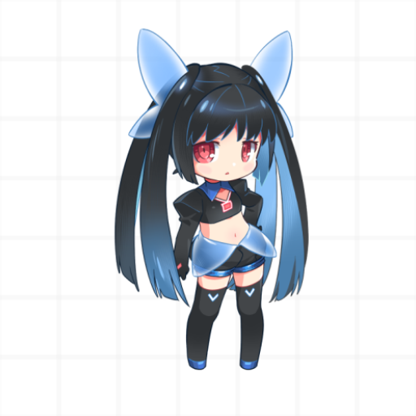

<div align="center">

  <a href="https://bgm.tv">
    
  </a>

  <h1 align="center">Bangumi Multiplatform</h1>

  <p align="center">
    <b>基于 Kotlin Multiplatform (KMP) & Compose Multiplatform 打造的 Bangumi.tv 跨平台全功能客户端</b>
  </p>

  <p align="center">
    <a href="https://github.com/xiaoyvyv/bangumi"></a>
    <a href="https://github.com/xiaoyvyv/bangumi/actions"></a>
    <a href="https://github.com/xiaoyvyv/bangumi/releases"></a>
    <a href="https://github.com/xiaoyvyv/bangumi/releases"></a>
    <a href="https://www.gnu.org/licenses/gpl-3.0"></a>
  </p>

  <p align="center">
    <a href="https://github.com/xiaoyvyv/bangumi/releases"><b>📱 下载 Release APK</b></a> &nbsp;•&nbsp;
    <a href="https://play.google.com/store/apps/details?id=com.xiaoyv.bangumi"><b>🛒 Google Play</b></a> &nbsp;•&nbsp;
    <a href="https://qm.qq.com/q/YomiSMeyUs"><b>💬 QQ 交流群</b></a> &nbsp;•&nbsp;
    <a href="shared/core-resource/src/androidMain/res/values/strings.xml"><b>🌐 多语言贡献</b></a>
  </p>

  <p align="center">
    <code>Android</code> &nbsp;•&nbsp; <code>iOS</code> &nbsp;•&nbsp; <code>Desktop (JVM)</code>
  </p>

</div>

---

**Bangumi Multiplatform** 是一款基于 **Kotlin Multiplatform (KMP)** 与 **Compose Multiplatform** 构建的 [Bangumi.tv (番组计划)](https://bgm.tv) 第三方全功能跨平台客户端。

本项目采用现代化的 **MVI 架构** 与 **模块化设计**，支持 **Android**、**iOS** 以及 **Desktop (JVM)** 多端运行。不仅完整覆盖了 BGM.TV 的日常使用与社区功能，更内置了强大的 *
*自动化工作流引擎 (Workflow Engine)**、**Live2D 动态看板娘** 及多维度的番剧衍生资源聚合。

---

> [!NOTE]
> 💡 **版本演进说明**：原基于传统 Android View 视图架构实现的版本（已归档在 [`view`](https://github.com/xiaoyvyv/bangumi/tree/view) 分支，停止维护）。全平台最新版本已全面升级并转向现代化的
**Compose Multiplatform** 架构，目前直接在主分支 [`main`](https://github.com/xiaoyvyv/bangumi/tree/main)
> 上重构与持续迭代，提供更极致的渲染性能与多端跨平台体验！测试包请查阅 [GitHub Actions 构建产物](https://github.com/xiaoyvyv/bangumi/actions)。

---

## 🌟 核心特性

- **跨平台体验 (KMP + Compose Multiplatform)**：基于 Compose 声明式 UI 开发，多端共享核心业务逻辑，极致流畅。
- **全面覆盖 Bangumi 核心功能**：
  - **进度管理**：追番、看剧、读漫画、玩游戏状态一键更新与进度格子管理。
  - **条目与角色**：详尽的动画/书籍/三次元/游戏/音乐条目信息、角色图鉴、演职员与关系网。
  - **社区交流**：热门小组话题、时间线动态、日志、条目吐槽、评论回复与消息通知。
  - **探索发现**：每日放送日历、排行榜、搜条目/搜角色/搜目录、巡礼地图等。
- **强大的 Workflow 自动化工作流引擎**：
  - 声明式 DAG 节点编排，支持并行执行、分支合流（Fork/Join）、循环遍历与状态追踪。
  - 内置网络请求、HTML/JSON 解析、正则表达式提取、变量上下文及自定义 UI 交互副作用。
- **生动有趣的 Live2D 看板娘**：支持 Live2D 交互、模型更换及个性化配置。
- **衍生资源聚合与发现**：
  - 整合 **Mikan 蜜柑计划** 磁力资源及字幕组展开。
  - 整合 **Anime-Pictures** 及 **Pixiv** 高清插画/作品预览。
  - 图片/视频媒体预览与内置播放组件。
- **个性化定制与隐私安全**：
  - 支持 Material Design 3 动态主题配色、暗黑模式及多种视觉外观定制。
  - 代码完全开源，无广告、不收集隐私，数据多端无缝同步。

---

## 🏗️ 架构设计

项目采用严格的 **模块化设计** 与 **MVI (Model-View-Intent)** 架构：

```
bangumi-multiplatform/
├── composeApp/             # Compose Multiplatform 桌面/通用入口
├── android/                # Android 壳工程与 Application 配置
├── iosApp/                 # iOS Xcode 工程入口
├── shared/                 # 核心共享组件与基础库
│   ├── core/               # 基础公共类、MVI 架构基类、通用工具与类型定义
│   ├── core-native/        # C++ / Native 扩展（Live2D 渲染引擎等）
│   ├── core-resource/      # 共享图片、图标、多语言 Strings 资源
│   ├── data/               # 网络请求(Ktorfit/Ktor)、数据模型(DTO)、数据库与存储
│   ├── data-workflow/      # Workflow 工作流 DAG 执行引擎
│   ├── ui/                 # 共享 UI 组件、导航路由定义
│   ├── ui-platform/       # 平台差异化 UI 兼容组件
│   ├── ui-material3/       # Material Design 3 主题与样式库
│   └── ui-video/           # 视频播放器与全屏控制器组件
└── features/               # 独立业务功能模块（如 home, subject, workflow, settings 等）
```

- **MVI 架构**：依托 [Orbit MVI](https://github.com/orbit-mvi/orbit-mvi) 框架，遵循 `State` -> `Event/Intent` -> `SideEffect` 响应式数据流。
- **网络层**：基于 [Ktor 3](https://ktor.io/) 与 [Ktorfit](https://filippobest.github.io/ktorfit/) 构建类型安全的 API 请求体系。
- **依赖注入**：基于 [Koin](https://insert-koin.io/) 实现跨平台依赖注入。

---

**部分页面截图预览**


---

## 🚀 编译与构建

### 准备工作

- JDK 17 及以上
- Android Studio (最新 Canary/RC 版本推荐，需安装 Kotlin 及 Multiplatform 插件)
- Xcode (仅编译 iOS 版本需要)

### Gradle 编译命令

- **Android**：
  ```bash
  ./gradlew :android:assembleDebug
  ```
- **Desktop (JVM)**：
  ```bash
  ./gradlew :composeApp:run
  ```
- **构建测试与验证**：
  ```bash
  ./gradlew :shared:data:kspCommonMainKotlinMetadata
  ```

---

## 🤝 贡献与反馈

欢迎大家提出 Bug 反馈、功能建议或提交 PR！

- **QQ 讨论群**：[671395625](https://qm.qq.com/q/YomiSMeyUs)（欢迎交流与反馈问题）
- **多语言本地化翻译**：[Strings 资源文件 (`strings.xml`)](shared/core-resource/src/androidMain/res/values/strings.xml)
- **GitHub Issues**：[提交 Issue](https://github.com/xiaoyvyv/bangumi/issues)

开发人员：

- 小玉: [https://bangumi.tv/user/837364](https://bangumi.tv/user/837364)

喜欢这个项目的话，欢迎在 GitHub 上点个 ⭐ **Star** 支持一下！

---

## 📜 开源协议

本项目采用 [GPL-3.0 License](https://www.gnu.org/licenses/gpl-3.0) 开源协议。
